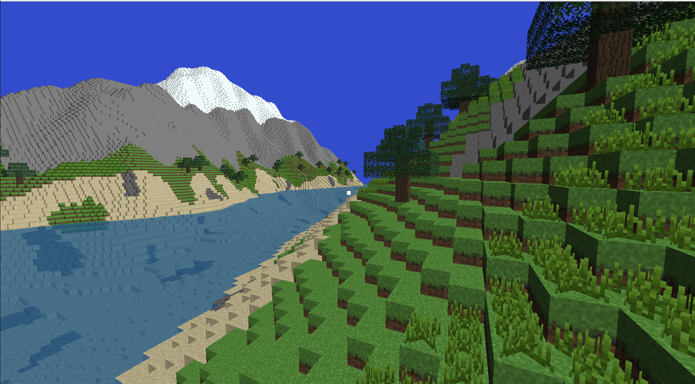

# GLCraft ⛏️

A personal Minecraft-style voxel engine built from scratch using OpenGL, featuring world generation, basic terrain, and essential performance optimizations.

  
*Above: A view of the generated world*

---

## 🌍 Features

- **Procedural World Generation**  
  Infinite terrain generation using noise functions for realistic hills and valleys.

- **Tree Generation**  
  Automatically spawns trees with randomized height and canopy shapes across the terrain.

- **Transparent Water**  
  Water blocks render with transparency and blend into the environment.

- **Chunk-Based World Management**  
  Terrain is split into manageable "chunks" to efficiently load and unload sections of the world as the player moves.

- **Face Culling**  
  Only visible block faces are rendered, massively improving rendering performance.

---

## ⚙️ Optimizations

- **Chunk Loading & Unloading**  
  Dynamically loads chunks near the player and unloads distant chunks to conserve memory.

- **Backface and Hidden Face Culling**  
  Prevents rendering of faces that are not visible, reducing GPU load.

---

## 🛠️ Tech Stack

- C++ with OpenGL
- GLFW for window and input
- GLM for math
- OpenGL for rendering